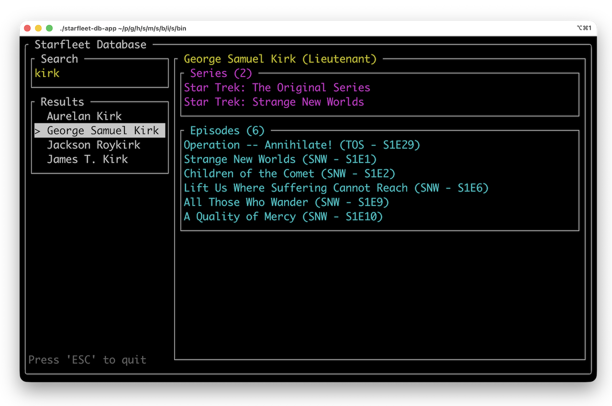
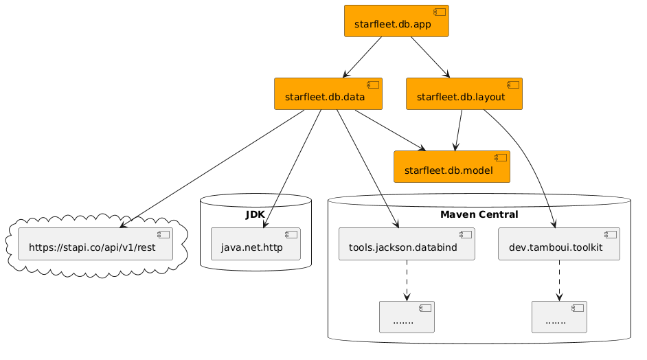

# Java Module System Example: Starfleet Database


An example application built with the Java Module System.
**Happy 60th birthday Star Trek!** 🖖



## Using

- For the data: [Star Trek API](https://stapi.co/)
- For JSON-to-Java: [Jackson Databind](https://github.com/FasterXML/jackson-databind)
- For the Terminal UI: [TamboUI](https://github.com/tamboui/tamboui)



## Build and run

### Traditional Jars that run through java command

```shell
# build
./gradlew install

# run
./modules/starfleet-db-app/build/install/starfleet-db-app/bin/starfleet-db-app
```

### Os-specific standalone app

```shell
# build
./gradlew jpackage

# run on mac (adjust path on other operating system)
modules/starfleet-db-app/build/packages/macos/StarfleetDB.app/Contents/MacOS/StarfleetDB
```
